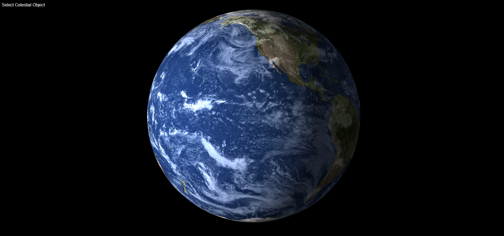

# Webgl Planet
3D Render of earth and moon using WebGl.

## Planet

## Earth moon

## Links
- [Webgl Planet](https://rameme.github.io/webgl-planet/)
- [Webgl Earth Moon](https://rameme.github.io/webgl-planet/template/earth_moon.html)

## Author
- Name: Ramim 
- Github: [https://github.com/rameme](https://github.com/rameme)